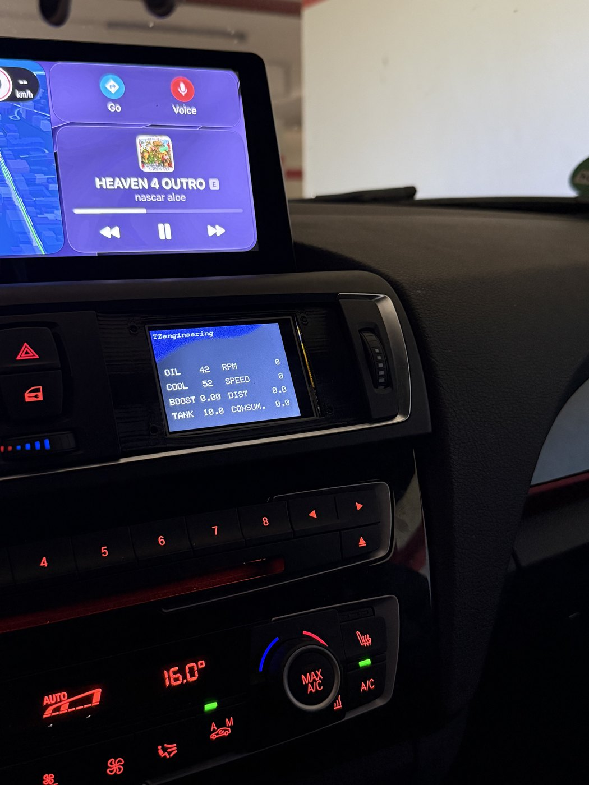
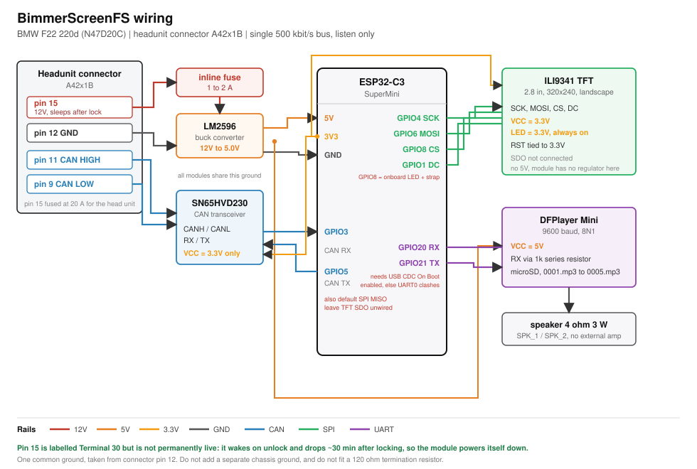

# BimmerScreenFS

A small gauge display for my 2014 BMW F22 220d. It hangs off the head unit's CAN pair, listens to
what the car is already saying, and shows the things the cluster does not: oil temperature, coolant
temperature, boost, fuel level to a tenth of a litre, and instant consumption. An ESP32-C3 drives a
2.8 inch panel and a DFPlayer Mini makes noises when something gets too hot or too loud.

I built it because the 220d's cluster has no oil temperature gauge and no boost gauge, and I wanted
both without an OBD dongle hanging out of the dash or a phone app in the way. Everything the display
needs is already on the bus. It just is not shown to you.



It sits in the centre air vent panel, under the iDrive screen. That slot is about the right size for
a 2.8 inch panel and it puts the readouts where you already glance for the climate control.

Status: the prototype in that photo has been working in the car for a while. I am drawing up a PCB
and proper schematics now, so the current build is still five modules on prototype board.

## What it shows

Eight values on one screen, updated about seven times a second:

| Readout | Notes |
|---------|-------|
| Oil temperature | warns over 95 °C |
| Coolant temperature | warns over 95 °C |
| Boost | bar, zeroed against ambient on every start so weather and altitude cancel out |
| RPM | white, yellow over 4000, red over 5000 |
| Speed | km/h |
| Trip distance | integrated from speed, resets with the ignition |
| Fuel | litres to about 0.1 L, better resolution than the car broadcasts |
| Consumption | L/100km moving, L/h at a standstill |

RPM is the only value that changes colour: white, yellow from 4000, red from 5000. Everything else
is drawn white. There is a `getTempColor()` in the sketch that ramps blue to green to red, but
nothing calls it yet, so oil and coolant do not change colour in the car.

Sounds on ignition on, ignition off, oil over 95 °C, coolant over 95 °C, and rpm over 4000. Each
warning has hysteresis so a value sitting on the limit does not chirp at you repeatedly.

There is a boot animation and a CRT style power-off collapse, because the ignition already tells the
module when to start and stop and it seemed a waste not to use it.

Two parts I am actually pleased with:

**The fuel readout calibrates itself.** The car broadcasts the cluster's computed level in 0.5 L
steps, and separately the two raw tank senders at much finer resolution on a curve nobody documents.
Every time the coarse value ticks over, the firmware records what the raw senders read at that
instant. Those anchors build up in flash across drives and let the raw values be interpolated to
about 0.1 L. It also works out on its own which raw field belongs to which side of the saddle tank by
watching which one moves when a given side ticks.

**Boost zeroes itself.** The pressure field is absolute, not gauge, so it needs an ambient reference.
Whenever rpm is genuinely 0 the manifold is at atmospheric, so that reading becomes the new
reference. It gets saved to flash too, so starting the engine before the display has finished booting
does not leave you with a dead gauge for the whole drive.

## Hardware

| Part | Role | Rough price |
|------|------|-------------|
| ESP32-C3 SuperMini | firmware, CAN decode, drives the panel | 4 to 5 |
| SN65HVD230 breakout | CAN transceiver, 3.3V | 4 to 10 |
| 2.8 inch ILI9341 SPI TFT, 320x240 | the screen | 6 to 12 |
| DFPlayer Mini | sounds off a microSD, 5V | 5 to 6 |
| LM2596 buck module | 12V down to 5.0V | 1 to 3 |

Plus a 4 ohm 3 W speaker, which the DFPlayer's own 3 W amp drives directly and a microSD card. Roughly 25 to 40 EUR all in. Full list with
links and the reasoning behind each choice is in [docs/hardware/BOM.md](docs/hardware/BOM.md).

## Wiring

Power and CAN both come off the head unit connector (A42x1B): pin 15 for 12V, pin 12 for ground,
pin 11 for CAN high, pin 9 for CAN low.

That 12V rail is worth understanding, because it is what makes the whole thing self-managing. The
connector labels it Terminal 30, but on this car it is not permanently live: it comes up when the car
is unlocked and drops roughly 30 minutes after it is locked, since BMW's energy management sleeps the
head unit feed. So the display powers itself up when you get in, finishes its shutdown animation
after ignition off because the rail is still there, and then goes off by itself later. No sleep code,
and nothing to flatten the battery. If you tap a genuinely permanent feed instead, that stops being
true, so check your rail first.

| Signal | GPIO |
|--------|------|
| CAN RX / TX | 3 / 5 |
| TFT SCK / MOSI / CS / DC | 4 / 6 / 8 / 1 |
| DFPlayer RX / TX | 20 / 21 |



Full pin tables are in [docs/hardware/pinout.md](docs/hardware/pinout.md) and the wiring notes,
including the three pin conflicts that work by luck rather than design, are in
[docs/hardware/schematic.md](docs/hardware/schematic.md). Read the pinout doc before wiring anything.
GPIO5 is CAN TX and also the C3's default SPI MISO, and GPIO8 is chip select and also the onboard
LED and a boot strapping pin.

## CAN

One bus at 500 kbit/s, and the TWAI controller is opened `TWAI_MODE_LISTEN_ONLY`. It never transmits,
never ACKs, and never puts error frames on the wire, so it cannot interfere with the car's own
arbitration. That was deliberate.

Nine IDs, eight of them decoded and used:

| ID | Carries |
|----|---------|
| `0x0A5` | rpm |
| `0x1A1` | speed |
| `0x2C4` | fuel integrator, for consumption |
| `0x2F3` | manifold pressure |
| `0x2F8` | date and time, not used yet |
| `0x130` | terminal status, drives power on and off |
| `0x330` | odometer, coarse fuel level, range |
| `0x349` | raw tank senders |
| `0x3F9` | coolant and oil temperature |

Formulas, byte offsets, sample rates and the reasoning behind each decode are in
[docs/can-bus/can-ids.md](docs/can-bus/can-ids.md). There is a
[DBC file](docs/can-bus/bimmerscreenfs.dbc) if you want to load this into SavvyCAN or cantools, and
my [original notes](docs/can-bus/canbusfindings-raw.txt).

## Getting it running

```
Arduino IDE 2.x, board: ESP32C3 Dev Module
Libraries: Adafruit GFX, Adafruit ILI9341, Adafruit BusIO, DFRobotDFPlayerMini
```

**Set USB CDC On Boot to Enabled.** The DFPlayer sits on GPIO20 and GPIO21, which are the chip's
default UART0 pins. With USB CDC off, `Serial` grabs them and the audio silently stops working while
everything else looks fine.

This uses Adafruit's ILI9341 driver, not TFT_eSPI, so there is no `User_Setup.h` to edit. The display
pins are in the sketch and SCK and MOSI come from the board's default SPI.

For sound, put five MP3s on a FAT32 microSD named `0001.mp3` through `0005.mp3`: ignition on, oil
warning, coolant warning, rpm warning, ignition off. Copy them across one at a time, because
DFPlayer indexes tracks by the order they were written to the card and not by filename. Getting that
wrong is why people end up with the shutdown chime on startup. Note that not using a DFPlayer will cause a boot-loop.
I will create a future sketch for use without it.

Full instructions and how to test on a bench with no car are in
[docs/firmware/build-and-flash.md](docs/firmware/build-and-flash.md).

## Known problems

**Consumption is about 4% high.** At wide open throttle I read 29.5 L/100km where the cluster said
28.2. `LITRES_PER_COUNT` in the sketch is the knob for that.

**The boost scaling is well supported but not proven.** Everything about how `0x2F3` behaves says it
is a real manifold sensor at 0.5 mbar per count, and it maps correctly everywhere I can check it, but
I have not confirmed it against a scan tool.

**Tank accuracy needs a few drives.** Calibration anchors only appear when the cluster's half-litre
value ticks over with the engine running. Until then the readout falls back to the coarse value.

**Gray display when IGNITION OFF.** Currently the TFT display's backlight is directly wired to 3.3V from the ESP32.
The ESP32 gets power the moment ACC Power turns on in the car (i.e unlocking it), and turns off about 30 min after locking the car.
That means, when the ignition is not turned on, but the car is unlocked, the screen will be gray due to backlight bleed. 
I am currently looking to powering the backlight directly from the Buck Converter, and using a MOSFET to switch that power on and off using the ESP32.
That should eliminate that issue.


## Credits

[loopybunny.co.uk/CarPC/k_can.html](http://www.loopybunny.co.uk/CarPC/k_can.html) is where I started
and it is what anyone doing this should read first. It documents an E9x rather than an F-series car,
so it told me which IDs were worth watching rather than what they contain on mine. The formulas in
this repo I worked out from my own logs on the F22, and where the E-series decode is actively
misleading I have said so in the CAN doc. The fuel sender scaling in particular does not carry over.

## Licence

MIT, see [LICENSE](LICENSE). It was GPL-3.0 until 2026-07-30; the reason for the change is in the
[changelog](CHANGELOG.md).

One exception: `src/esp32c3sp_firmware_bmw/Adafruit_ILI9341.h` is Adafruit's file, written by Limor
Fried, and stays under its own BSD licence. The full notice is in the header of that file, where
their licence requires it to be.

## Disclaimer

You are splicing into a moving car's data bus. I have tried to make this as low risk as it can be,
which is why it is listen-only and cannot transmit, but it is still your car and your wiring.

- Fuse the tap. Pin 15 is on a 20 A fuse that exists to protect the head unit, and it will not
  protect the thin wire you just added. Use 1 to 2 A inline.
- Do not fit a termination resistor. The bus is already terminated at both ends.
- Keep the stub short and the pair twisted up to the transceiver.
- The transceiver is a 3.3V part. 5V on its `VCC` will kill it.
- Check the regulator output on a meter before connecting anything to it.

If you do not want to modify your car, do not. I am not responsible for your wiring, your battery, or
your warranty.
