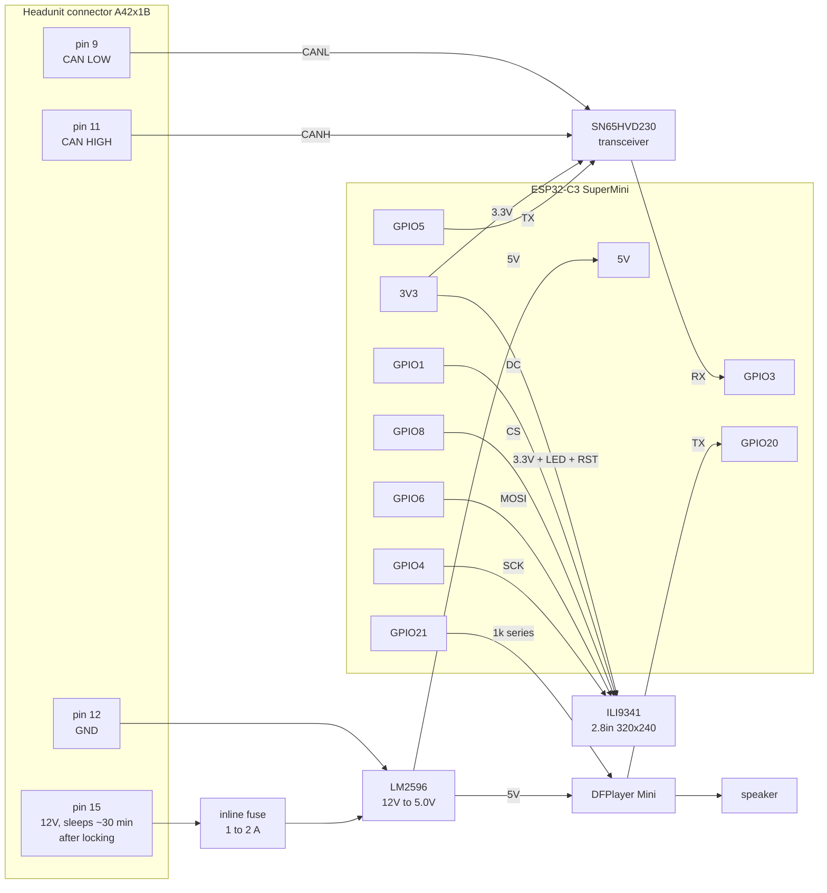

# Wiring

Block level. This is five modules on a piece of prototype board. A PCB and proper schematics are
being drawn up, and this page will be replaced when they exist.

Full pin tables are in [pinout.md](pinout.md). The car side connector is documented in
[headunit-connector-a42x1b.jpg](headunit-connector-a42x1b.jpg).

## KiCAD Schematic

## Grounds

Everything shares one ground, and that ground is the car's, taken from pin 12 of the headunit
connector. The transceiver needs the same reference the car uses or CANH and CANL sit at the wrong
common mode voltage and the bus goes deaf.

Do not run a separate chassis ground alongside pin 12. Two ground paths of different lengths is how
you get a loop, and on a CAN tap that shows up as intermittent frame errors that are miserable to
chase.

## Fusing

Pin 15 is fused at 20A because that fuse exists to protect the head unit's wiring, not a 250 mA
display. Put a 1 to 2 A inline fuse in the tap, as close to the connector as the loom allows. A
short in the module without one means a 20A fuse holding happily while the thin wire you added
becomes the fuse. I personally did not use one, but I recommend doing so. _Do as I say, not as I do_

## Power and standby

Pin 15 on the BMW F22 Headunit seems to be tapped to ACC power. The rail comes up when the car is unlocked and drops about 30
minutes after it is locked, because BMW's energy management sleeps the head unit's supply rather
than feeding it continuously.

That turns out to be exactly what this build wants, and it is why there is no sleep code in the
firmware:

- Unlock the car and the display boots on its own.
- Ignition off runs the shutdown sound and the CRT collapse, then blanks the screen. The rail is
  still live at that point, so the animation actually gets to finish instead of being cut off
  mid-frame.
- Half an hour or so after locking, the rail drops and the module goes off with it.

So there is no parasitic drain to design around. The module does stay awake through that half hour
with the backlight lit behind a black screen, which is wasted current, but it is bounded and the
car decides when it ends. Driving the backlight from a GPIO through a transistor would tidy that up
and is the only reason to bother.

**This depends entirely on the rail you tap.** If you find a genuinely permanent 12V feed instead,
none of the above holds: nothing in the firmware sleeps, the backlight is hardwired to 3.3V, and you
will flatten the battery over a couple of weeks. Confirm what your rail actually does, by leaving
the car locked and measuring, before you trust it.

## Tapping the bus

Pins 9 and 11 at the headunit connector are the pair I used. Reaching them means pulling the head
unit, which on the F22 is trim clips and a few screws. Takes 3 minutes with some practice. 

I would rather solder and heatshrink onto the back of the connector than use a piercing tap. A
piercing tap on a twisted CAN pair _CAN_ break the twist at the junction and lets the stub radiate, and
it eventually corrodes. Impedance matching, signal reflections yada yada yada. I _did_ use taps, but when doing so, 
keep tap short, twisted and as close to the termination as possible. Try to match wire guage as well!

Keep the stub short. A tap on a 500 kbit/s bus is an unterminated branch, and long branches reflect.
Mine is about 10 cm from connector to transceiver. Keep CANH and CANL twisted together right up to
the transceiver pins.
